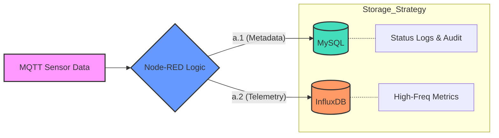

Canva : https://www.canva.com/design/DAHDs81o3YU/WzdQnhCHgtNSZu9Ch2T4ZA/edit?utm_content=DAHDs81o3YU&utm_campaign=designshare&utm_medium=link2&utm_source=sharebutton
# Multi-Tier IoT Data Pipeline: MySQL & InfluxDB Integration

This project demonstrates an advanced industrial data pipeline that ingests MQTT-style telemetry and implements **Polyglot Persistence**. It intelligently routes data into two separate databases based on the data's nature: **MySQL** for structured metadata (a.1) and **InfluxDB** for high-frequency metrics (a.2).

## 🚀 Node-RED Data Pipeline

The pipeline is designed to simulate industrial sensor behavior and handle data decoupling at the edge.

### 1. Flow Description
- **Inject Node**: Acts as the system heartbeat, triggering data generation every 3 seconds.
- **Function Node**: The "Brain" of the flow. It parses incoming JSON data and splits it:
    - **a.1 (Relational)**: Prepares `device_name` and `status` for SQL logging.
    - **a.2 (Time-Series)**: Prepares raw `voltage` and `tags` for InfluxDB streaming.
- **MySQL Node**: Executes persistent relational storage for audit trails and status monitoring.
- **InfluxDB Node**: Handles high-velocity telemetry data with optimized time-series storage.
- **Catch Node**: A centralized error handler that captures any background connection issues without disrupting the flow.



---

## 🗄️ Database Setup

Note: You must initialize both databases before deploying the Node-RED flow.

### A. MySQL Configuration
Execute this script to create the logging schema:
```sql
-- 1. Create the Database
CREATE DATABASE IF NOT EXISTS smart_mill_db;
USE smart_mill_db;

-- 2. Create the Table for Metadata (a.1)
CREATE TABLE IF NOT EXISTS device_status_logs (
    id INT AUTO_INCREMENT PRIMARY KEY,
    device_name VARCHAR(50),
    status_code INT,
    log_message VARCHAR(100) DEFAULT 'DATA_RECEIVED',
    created_at TIMESTAMP DEFAULT CURRENT_TIMESTAMP
);
```
### B. InfluxDB Configuration (Time-Series)
Since InfluxDB 2.x is primarily configured via its Web UI, follow these steps to prepare the environment for **a.2 (Telemetry)** data:

1. **Create a Bucket**:
   - Log in to your InfluxDB dashboard (usually at `http://localhost:8086`).
   - Navigate to **Load Data** > **Buckets**.
   - Click **+ Create Bucket** and name it `sensor_data_stream`.
   - Set a **Retention Policy** (e.g., `30 days`) to automatically manage storage and disk space.

2. **Generate API Token**:
   - Go to **Load Data** > **API Tokens**.
   - Generate a new **"Read/Write API Token"** specifically for the `sensor_data_stream` bucket.
   - **Note**: Copy this token immediately; you will need to paste it into the Node-RED InfluxDB node configuration.

3. **Confirm Organization**:
   - Check your profile or the **About** page to retrieve your exact **Organization Name**.
   - *Warning: This field is case-sensitive (e.g., "MyOrg" is different from "myorg").*

> [!TIP]
> After setting up the bucket and token, ensure the InfluxDB node in Node-RED shows a green **"connected"** status. If it shows "not found", re-verify your Organization name spelling.
