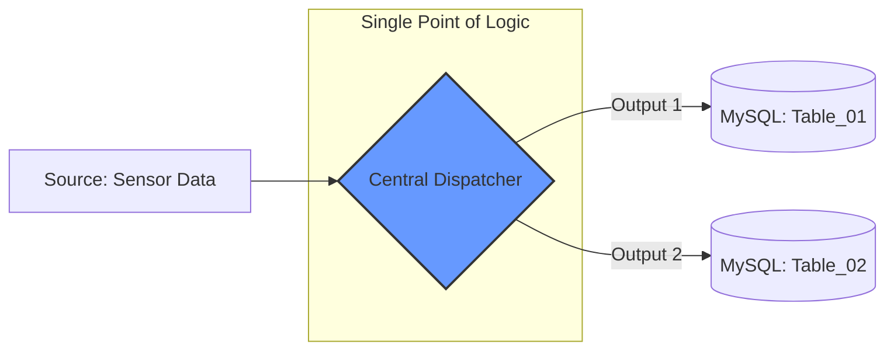
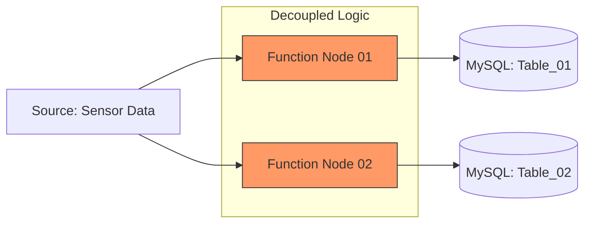

canva: https://www.canva.com/design/DAHEEvFM8d8/GO8nDZHs9ZIMZZ8QRxEcsQ/edit?utm_content=DAHEEvFM8d8&utm_campaign=designshare&utm_medium=link2&utm_source=sharebutton
# IoT Data Strategy: Centralized vs. Independent Branching

This document compares two methods for routing sensor data into multiple MySQL tables, helping to visualize the architectural differences for future scaling.

---

## 🚀 Comparison Graph (Visualizing the Difference)

### Method A: Centralized Dispatcher (The "Router" Approach)
*Logic is concentrated in one node with multiple outputs.*


### Method B: Independent Processors (The "Parallel" Approach)
Logic is split into separate nodes for each destination.

💡 Architectural Memory Hook
Method A is like a Post Office: One sorting center dispatches mail to different cities.

Method B is like Individual Couriers: Each courier takes one letter to one specific city independently.
### create database
```
-- 1. Access your Node-RED database
USE node_red_db;

-- 2. Create Table_01 (Focus: Operational/Voltage Logs)
CREATE TABLE IF NOT EXISTS table_01 (
    id INT AUTO_INCREMENT PRIMARY KEY,
    sensor_id VARCHAR(50),
    temperature FLOAT,
    volt FLOAT,
    status INT,
    created_at TIMESTAMP DEFAULT CURRENT_TIMESTAMP
);

-- 3. Create Table_02 (Focus: Performance/Value Logs)
CREATE TABLE IF NOT EXISTS table_02 (
    id INT AUTO_INCREMENT PRIMARY KEY,
    sensor_id VARCHAR(50),
    temperature FLOAT,
    value FLOAT,
    status INT,
    created_at TIMESTAMP DEFAULT CURRENT_TIMESTAMP
);
```
# 🛠️ Troubleshooting: Missing Data in Multi-Table Routing

### **Issue Description**
When using a **Function Node** to split a single data source into multiple MySQL tables (Method A), the following symptoms occur:
* **Table 01** receives duplicate records.
* **Table 02** remains empty or receives no data at all.
* Only one SQL query is visible in the Debug panel even though the code contains two `INSERT` statements.

---

### **Root Cause: Port Mapping Mismatch**
In Node-RED, the JavaScript statement `return [msg1, msg2];` uses **Array Index Mapping**:
* `msg1` (Index 0) is routed to **Output Port 1**.
* `msg2` (Index 1) is routed to **Output Port 2**.

By default, Function Nodes are created with only **1 Output Port**. If this setting is not updated to match the number of messages in your array, Node-RED will either ignore the second message or "stack" both messages into the first port, causing the database node to execute multiple queries on the same table.

---

### **Solution / Resolution**

#### **1. Update Node Configuration**
1.  **Double-click** the Function Node.
2.  Navigate to the **Setup** (or Appearance) tab.
3.  Locate the **Outputs** field at the bottom.
4.  Change the value from `1` to **`2`**.
5.  Click **Done** and then click **Deploy**.

#### **2. Correct Physical Wiring**
After updating the output count, the node will show two grey circles on its right side:
* **Output 1 (Top Circle):** Connect this wire to the MySQL node for `Table_01`.
* **Output 2 (Bottom Circle):** Connect this wire to the MySQL node for `Table_02`.

#### **3. Code Structure Verification**
Ensure your code returns the messages as an array at the end of the script:
```javascript
// Example of correct return structure
return [msg1, msg2];
