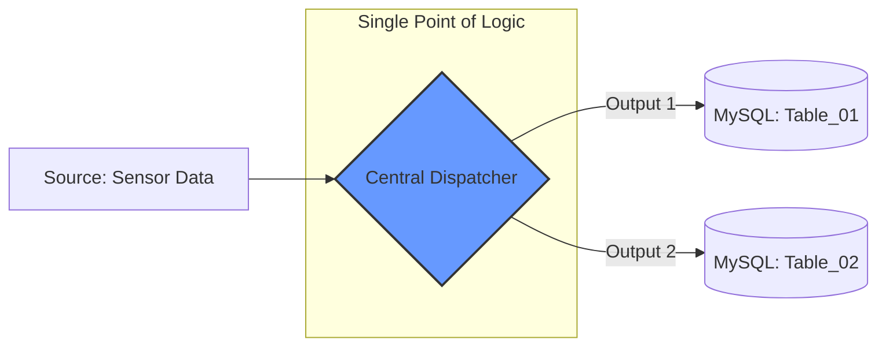
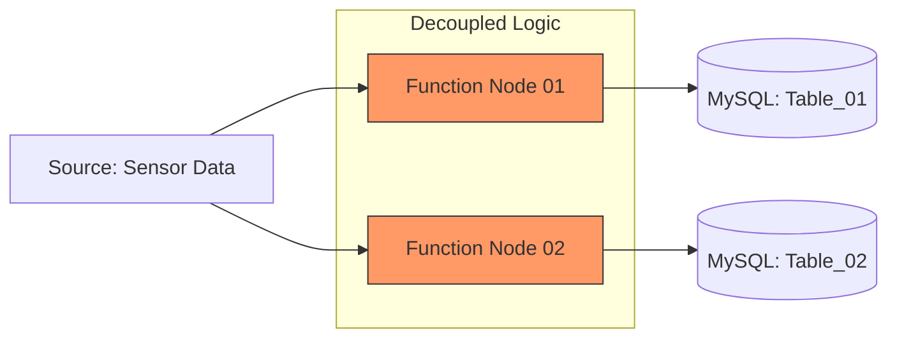

# IoT Data Strategy: Centralized vs. Independent Branching

This document compares two methods for routing sensor data into multiple MySQL tables, helping to visualize the architectural differences for future scaling.

---

## 🚀 Comparison Graph (Visualizing the Difference)

### Method A: Centralized Dispatcher (The "Router" Approach)
*Logic is concentrated in one node with multiple outputs.*

### Method B: Independent Processors (The "Parallel" Approach)
Logic is split into separate nodes for each destination.

💡 Architectural Memory Hook
Method A is like a Post Office: One sorting center dispatches mail to different cities.

Method B is like Individual Couriers: Each courier takes one letter to one specific city independently.
