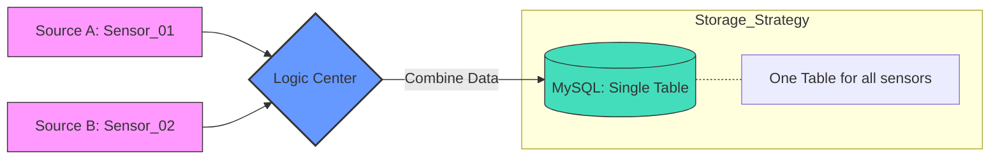

canva: https://www.canva.com/design/DAHDygcdCko/4JjF5BS80YCulixF_14bSQ/edit?utm_content=DAHDygcdCko&utm_campaign=designshare&utm_medium=link2&utm_source=sharebutton
# IoT Data Pipeline: Dual-Source MySQL Consolidation

This project shows an industrial IoT pipeline focused on **Data Consolidation**. It captures data from two different sensors (e.g., Voltage and Current) and saves them into **one single MySQL table**.

## 🚀 Node-RED Automation Flow

This design standardizes data formats from different devices into one organized database.

### 1. Flow Description
- **Dual Input Nodes**: 
    - **Sensor 01**: Simulates the first set of industrial data.
    - **Sensor 02**: Simulates the second set of industrial data.
    - *Setup: Auto-trigger every 1 minute to keep data flowing.*
- **Function Node (The Brain)**: 
    - **Identify Source**: Uses `msg.topic` to check if data is from Sensor 01 or 02.
    - **SQL Generation**: Converts different data into a single `INSERT` command for MySQL.
    - **Data Cleaning**: Ensures all numbers are clean and ready for the database.
- **MySQL Node**: Connects to `node_red_db` and saves the combined data into the table.

### 2. System Architecture

### Database Setup
-- 1. Use your existing database
USE node_red_db;

-- 2. Create a new table for combined data
CREATE TABLE IF NOT EXISTS sensor_aggregation_logs (
    id INT AUTO_INCREMENT PRIMARY KEY,
    sensor_name VARCHAR(50),   -- To tell if it is Sensor 01 or 02
    reading_value FLOAT,       -- The data value
    status_code INT,           -- Device status
    created_at TIMESTAMP DEFAULT CURRENT_TIMESTAMP
);
