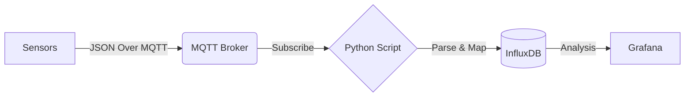

pythonscript_mqttbroker_questdb.py
# iot-mqtt-influxdb-integration
# 🚀 IoT Data Bridge: MQTT to InfluxDB

This project demonstrates how to build a real-time IoT data pipeline using Python. It subscribes to sensor data from an **MQTT Broker**, parses nested JSON payloads, and stores them into **InfluxDB** for time-series analysis.

---

## 📋 Project Overview

In Industrial IoT (IIoT), sensors often send high-frequency data in JSON format. This project handles:
1. **Protocol Conversion**: Bridging MQTT (Pub/Sub) to InfluxDB (Line Protocol).
2. **Data Parsing**: Extracting values from nested structures (e.g., `PSTR_bar`, `PDIG_ma`).
3. **Storage**: Efficiently saving data for visualization in tools like Grafana.

---

## 🛠️ Tech Stack

- **Language**: Python 3.8+
- **Protocol**: MQTT (Paho-MQTT)
- **Database**: InfluxDB (Time Series)
- **Security**: Dotenv (Managing credentials safely)

---

## 📊 Architecture

----
step 1 (Clone):git clone https://github.com/shenq0428/iot-mqtt-influxdb-integration.git
        cd iot-mqtt-influxdb-integration
step 2 (Install Dependencies):pip install -r requirements.txt
step 3 (Setup Config): setup own configuration in .env folder
step 4 (Run): run the main code -> python main.py
