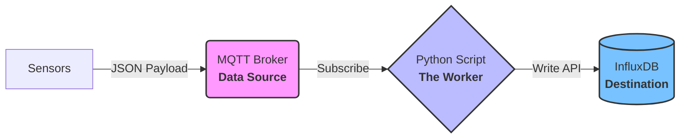

# 🚀 IoT Data Bridge: MQTT to InfluxDB

This project demonstrates how to build a real-time IoT data pipeline using Python. It subscribes to sensor data from an **MQTT Broker**, parses nested JSON payloads, and stores them into **InfluxDB** for time-series visualization and monitoring.

---

## 📋 Project Overview

In Industrial IoT (IIoT), sensors often send high-frequency data in JSON format. This project handles:
1. **Protocol Conversion**: Bridging MQTT (Pub/Sub) to InfluxDB (Flux/Bucket).
2. **Data Parsing**: Extracting values from nested structures (e.g., `PSTR_bar`, `PDIG_ma`) with safety fallbacks.
3. **Storage**: Storing data as **Points** (Fields & Tags) for high-speed querying and dashboarding in InfluxDB or Grafana.

---

## 🛠️ Tech Stack

- **Language**: Python 3.8+
- **Protocol**: MQTT (Paho-MQTT v2)
- **Database**: **InfluxDB** (Time-series Database)
- **Security**: Dotenv (Managing credentials and tokens safely)

---

## 📊 Architecture

----
Quick Start
- **step 1 (Clone)**:git clone https://github.com/shenq0428/shenq0428-iot-main-project.git
        cd mqttbroker-questdb-python
- **step 2 (Install Dependencies)**:pip install -r requirements.txt
- **step 3 (Setup Config)**: copy the example from (.env.example) folder ,create a newfolder name (.env) and setup own configuration.
- **step 4 (Run)**: run the main code -> python main.py
----
