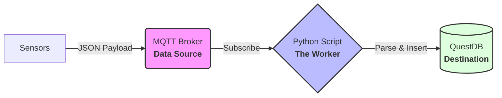

pythonscript_mqttbroker_questdb.py
# 🚀 IoT Data Bridge: MQTT to QuestDB

This project demonstrates how to build a real-time IoT data pipeline using Python. It subscribes to sensor data from an **MQTT Broker**, parses nested JSON payloads, and stores them into **QuestDB** for high-performance time-series analysis.

---

## 📋 Project Overview

In Industrial IoT (IIoT), sensors often send high-frequency data in JSON format. This project handles:
1. **Protocol Conversion**: Bridging MQTT (Pub/Sub) to QuestDB (SQL / ILP).
2. **Data Parsing**: Extracting values from nested structures (e.g., `PSTR_bar`, `PDIG_ma`).
3. **Storage**: Efficiently saving data for visualization in tools like Grafana using QuestDB's SQL capabilities.

---

## 🛠️ Tech Stack

- **Language**: Python 3.8+
- **Protocol**: MQTT (Paho-MQTT)
- **Database**: **QuestDB** (High-performance Time-series SQL Database)
- **Security**: Dotenv (Managing credentials safely)

---

## 📊 Architecture



----
- **step 1 (Clone)**:git clone https://github.com/shenq0428/shenq0428-iot-main-project.git
        cd mqttbroker-questdb-python
- **step 2 (Install Dependencies)**:pip install -r requirements.txt
- **step 3 (Setup Config)**: copy the example from (.env.example) folder ,create a newfolder name (.env) and setup own configuration.
- **step 4 (Run)**: run the main code -> python main.py
----
## 🔍 Troubleshooting

Based on real-world testing, if the script runs but behaves unexpectedly, refer to the following solutions:

### 1. Script connected but no data received
**Phenomenon:** The console shows `✅ 已成功连接到 NovaPlus Broker!` but remains silent without any incoming data logs.

**Root Cause:** The `MQTT_TOPIC` in your `.env` is **statically defined** to a specific path (e.g., `data/SAMYSK_POM_123456`). If the actual sensor is publishing to a slightly different path or if the ID has changed, the script will ignore all other incoming traffic

**Solution (The Wildcard Method):**
1. Temporarily change your `.env` file to use a wildcard to listen to all traffic:
   ```env
   MQTT_TOPIC=#